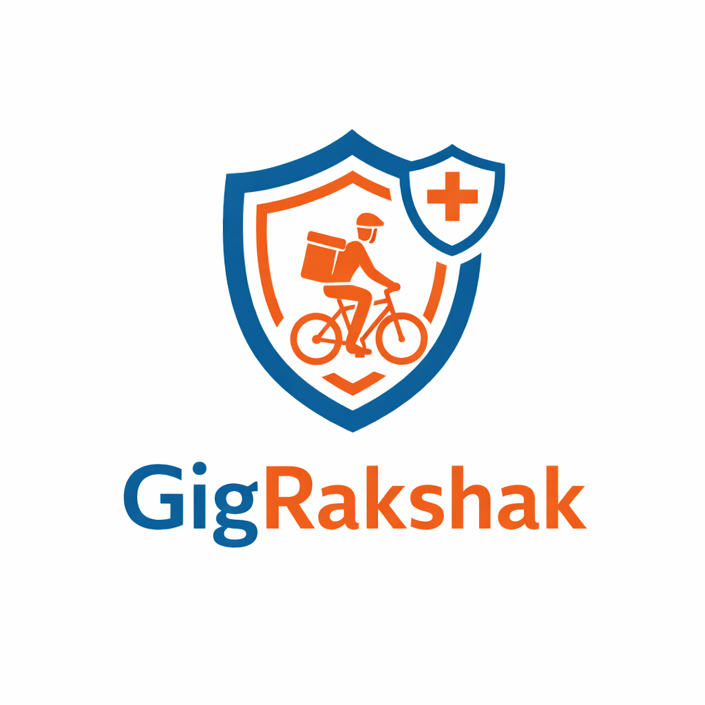

<div align="center">



<br/>

# GigShield

### _Your income. Your safety. Automatically protected._

<br/>

[](LICENSE)
[](https://reactjs.org)
[](https://www.typescriptlang.org)
[](https://vitejs.dev)
[](https://tailwindcss.com)
[](https://devtrails.in)

<br/>

> India's first AI-powered parametric insurance platform for gig economy delivery workers.  
> No forms. No waiting. Protection that activates before you even ask.

<br/>

---

</div>

## 📋 Table of Contents

- [Overview](#-overview)
- [Core Problem](#-the-problem-we-solve)
- [Key Features](#-key-features)
- [Design System](#-design-system)
- [Tech Stack](#-tech-stack)
- [App Architecture](#-app-architecture--routes)
- [Getting Started](#-getting-started)
- [Screenshots](#-feature-highlights)
- [Contributing](#-contributing)
- [License](#-license)

---

## 🎯 Overview

**GigShield** is an AI-powered parametric insurance and safety platform built specifically for India's 12 million+ gig economy delivery workers — riders on Zomato, Swiggy, Zepto, Blinkit, Amazon, and Flipkart.

**What makes it parametric?** Traditional insurance requires you to file a claim and wait weeks. GigShield monitors real-world triggers (rainfall, AQI, heatwave, curfews) and _automatically_ processes a payout the moment a threshold is crossed — no form, no call, no wait. ₹800 lands in your UPI in under 60 seconds.

Beyond insurance, GigShield is a complete worker safety ecosystem: live zone monitoring, emergency SOS, AI-powered legal guidance, women's safety features, and a document vault — all in one app.

---

## ❗ The Problem We Solve

| Problem                                              | GigShield Solution                                      |
| ---------------------------------------------------- | ------------------------------------------------------- |
| Delivery halted by heavy rain — zero income          | Parametric rain trigger → auto UPI payout               |
| Police stop, worker doesn't know their rights        | AI legal chatbot + 24/7 advocate connect                |
| Accident mid-delivery, emergency contact unreachable | One-tap SOS → location shared + legal team notified     |
| Women riders feel unsafe on late-night routes        | Women Safety Shield with panic button + Mahila helpline |
| Documents needed urgently — not at hand              | Encrypted document vault, shareable in 1 tap            |
| Claims take weeks to process                         | AI fraud check in <60 seconds → instant payout          |

---

## ✨ Key Features

### 📊 Real-Time Zone Monitoring

- Live weather, AQI, heatwave, and civil disruption tracking per delivery zone
- Visual trigger progress bars showing distance from payout threshold
- Automatic claim creation the moment a threshold is breached
- Zone risk heat map with nearby zone comparison

### 💰 Parametric Insurance & Claims

- **Zero-form claims** — AI detects trigger, verifies GPS, pays out
- Fraud detection engine with AI risk scoring (0–100)
- Full claim audit trail with timestamps down to the minute
- Appeal workflow for claims under review

### 🆘 Emergency SOS System

- **Hold-to-activate** SOS button with 2-second confirmation ring
- Sequential auto-actions: GPS log → emergency contact alert → audio clip → legal team notification
- Live location sharing for 30 minutes post-SOS
- Advisor countdown timer connecting to on-call advocate

### ⚖️ Legal Aid Suite

- AI chatbot "Shield AI" for 24/7 legal guidance
- Know Your Rights guide (police stops, customer complaints, FIR process)
- FIR Filing Assistant with AI-structured complaint template
- Verified advocate network with live availability status

### 🚗 Active Delivery Tracker

- SVG mock map with live rider position animation
- Zone-by-zone risk and earnings breakdown per delivery
- Route deviation detection with safety check prompt
- Risk zone bonuses credited in real time

### 👩 Women Safety Shield

- Dedicated women's SOS with Mahila helpline integration
- Unsafe customer reporting system with platform forwarding
- Safe route preferences (avoid isolated roads, prefer lit roads after dark)
- Journey check-in with auto-alert if ETA missed
- Night shift 1.5× payout multiplier

### 🏥 Medical Emergency Hub

- Scenario-specific first aid guidance (accident, heat stroke, AQI distress, animal attack)
- First aid expense claims (up to ₹1,500 on Premium)
- Nearby hospital quick-links with emergency numbers

### 🗂️ Document Vault

- Store Aadhaar, Driving Licence, Platform ID, Vehicle RC, Insurance
- One-tap emergency share with legal team
- Document verification status tracking

---

## 🎨 Design System

GigShield uses a purpose-built dark design system optimized for glanceability — riders check their app in 2-second windows between deliveries, often in sunlight.

### Color Palette

| Token              | Hex       | Usage                                   |
| ------------------ | --------- | --------------------------------------- |
| `--bg-primary`     | `#080D1A` | Main background (dark navy)             |
| `--bg-secondary`   | `#0F1729` | Card / elevated surfaces                |
| `--bg-tertiary`    | `#1A2540` | Inputs, secondary cards                 |
| `--accent-teal`    | `#1AAF80` | Primary CTA, active status, paid claims |
| `--accent-amber`   | `#F0A500` | Warnings, moderate risk, under-review   |
| `--accent-red`     | `#E5484D` | SOS, danger, critical alerts            |
| `--accent-pink`    | `#E86BA0` | Women Safety module accent              |
| `--accent-blue`    | `#3B82F6` | Informational elements only             |
| `--text-primary`   | `#F0F4FF` | Headings, key values                    |
| `--text-secondary` | `#8A9BC4` | Body copy, labels                       |

### Typography

| Role                    | Font            | Weights            |
| ----------------------- | --------------- | ------------------ |
| Headings                | **Sora**        | 400, 500, 600, 700 |
| Body / UI               | **DM Sans**     | 400, 500           |
| Monospace (coords, IDs) | **Courier New** | 400                |

### Component Standards

- **Cards:** `border-radius: 16px`, subtle `1px` border at 10% opacity
- **Buttons:** `border-radius: 12px`, minimum `48px` touch target height
- **Status Pills:** Color-coded with `15%` opacity backgrounds
- **Inputs:** Elevated background (`--bg-tertiary`), `10px` border-radius
- **SOS Button:** Minimum `140px` diameter on mobile, always with `sos-pulse` glow animation

### Animations

```css
@keyframes pulse-dot {
  /* Pulsing green active indicator */
}
@keyframes glow-ring {
  /* SOS red glow ring, 1.5s infinite */
}
@keyframes slide-up {
  /* 0.3s ease card entrance */
}
@keyframes fade-in {
  /* 0.2s ease content reveal */
}
```

---

## 🛠️ Tech Stack

### Frontend

| Technology       | Version | Purpose                                |
| ---------------- | ------- | -------------------------------------- |
| **React**        | 18.3    | UI component framework                 |
| **TypeScript**   | 5.8     | Type-safe JavaScript                   |
| **Vite**         | 5.0+    | Lightning-fast build tool & dev server |
| **Tailwind CSS** | 3.4     | Utility-first CSS framework            |
| **Shadcn/ui**    | latest  | Accessible, customizable UI components |

### Utilities & Data

| Technology       | Version | Purpose                          |
| ---------------- | ------- | -------------------------------- |
| **React Router** | v6      | Client-side routing & navigation |
| **Recharts**     | latest  | Charts and data visualization    |
| **Lucide React** | latest  | Icon library                     |
| **clsx**         | —       | Conditional className utility    |

### Styling & Design

| Technology       | Version | Purpose                            |
| ---------------- | ------- | ---------------------------------- |
| **PostCSS**      | 8.5     | CSS processing and transformations |
| **Autoprefixer** | 10.4    | Browser vendor prefix automation   |
| **Google Fonts** | —       | Sora & DM Sans typography          |

### Testing

| Technology     | Version | Purpose                              |
| -------------- | ------- | ------------------------------------ |
| **Vitest**     | 3.2+    | Unit testing framework (Vite-native) |
| **Playwright** | latest  | End-to-end browser testing           |
| **JSdom**      | 20.0+   | DOM implementation for testing       |

### Development & Quality

| Technology            | Version | Purpose                          |
| --------------------- | ------- | -------------------------------- |
| **ESLint**            | 9.32+   | Code linting & style enforcement |
| **TypeScript ESLint** | 8.38+   | TypeScript-aware linting         |
| **Node.js**           | 18+     | JavaScript runtime               |

### Architecture Highlights

- **No external APIs** — All data is mock/hardcoded (ready for backend integration)
- **Custom SVG Map** — Fully custom animated map for Active Delivery Tracker (no Google Maps API)
- **Dark Mode First** — All components optimized for 2-second glance readability in sunlight
- **Mobile-Responsive** — Desktop sidebar + mobile bottom nav automatically adapts
- **Accessibility (a11y)** — All interactive elements meet WCAG 2.1 AA standards

---

## 🗺️ App Architecture & Routes

GigShield has **18 routes** organized into **6 functional modules**:

#### 📍 Route Map

```
GigShield App Routes
└── Root (/)
    ├── Public Routes
    │   ├── /                    → Landing Page
    │   ├── /onboard             → 4-Step Onboarding Wizard
    │   └── /not-found           → 404 Error Page
    │
    ├── Worker Module (Dashboard & Tracking)
    │   ├── /dashboard           → Worker Home Dashboard
    │   │   └── Coverage status • Quick actions • Earnings summary
    │   ├── /zone-monitor        → Live Zone & Environmental Triggers
    │   │   └── Rain • AQI • Heatwave • Curfew thresholds
    │   ├── /delivery/active     → Active Delivery Tracker (SVG Map)
    │   │   └── Animated rider • Zone overlays • Risk zones
    │   └── /delivery/history    → Delivery & Earnings Log
    │       └── Past deliveries • Earnings breakdown
    │
    ├── Safety & Emergency Module
    │   ├── /sos                 → Emergency SOS (2-sec hold button)
    │   │   └── Auto-actions • Advocate notify • Location share
    │   └── /women-safety        → Women Safety Shield (Premium+)
    │       └── Panic button • Unsafe customer report • Safe routes
    │
    ├── Legal Aid Module (Full Suite)
    │   ├── /legal-aid           → Legal Aid Hub (entry point)
    │   ├── /legal-aid/advocate  → Advocate Connect Directory
    │   │   └── Availability • Specialization • Ratings
    │   ├── /legal-aid/police    → Police Support Guide
    │   │   └── Rights during stop • Document carry • Complaint process
    │   ├── /legal-aid/fir       → FIR Filing Assistant
    │   │   └── AI-structured form • Submit guidance
    │   └── /legal-aid/rights    → Shield AI Chatbot (24/7)
    │       └── Know Your Rights • AI legal guidance
    │
    ├── Claims & Support Module
    │   ├── /claims              → Claims Center (list view)
    │   │   └── Active • Approved • Under review • Archived
    │   ├── /claims/:id          → Individual Claim Detail
    │   │   └── Full audit trail • Trigger proof • Appeal workflow
    │   ├── /medical             → Medical Emergency Hub
    │   │   └── Scenario guides • Hospital locator • Claim submission
    │   └── /document-vault      → Secure Document Storage
    │       └── Aadhaar • License • RC • Platform ID • Insurance
    │
    └── Account Module
        ├── /profile             → User Profile & Settings
        │   └── Personal info • Plan status • Preferences
        └── /admin               → Admin / Insurer Dashboard (role-gated)
            └── Worker management • Claims review • Fraud detection
```

#### 🎯 Module Breakdown

| Module      | Routes | Purpose                       | Audience         |
| ----------- | ------ | ----------------------------- | ---------------- |
| **Worker**  | 4      | Dashboard, tracking, earnings | All workers      |
| **Safety**  | 2      | SOS, women features           | All / Premium+   |
| **Legal**   | 5      | AI + advocate + guides        | All / Standard+  |
| **Claims**  | 4      | Claims, medical, documents    | All              |
| **Account** | 2      | Profile, admin                | Workers / Admins |
| **Public**  | 3      | Landing, onboarding, 404      | Anyone           |

#### 🛠️ UI Layout Patterns

**Desktop (1024px+)**

- Left sidebar (220px): Logo, nav icons, user card
- Main content: Full-width with 20px padding
- Responsive grid: 2–3 columns for cards

**Tablet (768px–1023px)**

- Collapsible sidebar (tap logo to toggle)
- Single-column stack, full width
- Bottom nav still appears at 768px

**Mobile (<768px)**

- No sidebar
- Bottom tab navigation (5 primary tabs)
- Full-width content with 16px padding
- "More" tab opens drawer with secondary routes

### Navigation Structure

**Desktop Navigation:**

```
Sidebar (Fixed)
├── GigShield Logo (click to collapse)
├── Primary Nav Links
│   ├── Dashboard
│   ├── Zone Monitor
│   ├── Delivery Tracker
│   ├── Claims
│   └── SOS (always red)
├── Secondary Links (scroll)
│   ├── Medical
│   ├── Legal Aid
│   ├── Document Vault
│   └── Women Safety (if isWoman)
└── User Card (bottom)
    ├── Profile
    ├── Settings
    └── Sign Out
```

**Mobile Navigation:**

```
Bottom Tab Bar (Fixed)
├── Dashboard
├── Zone Monitor
├── Delivery Tracker
├── SOS
└── More (opens modal drawer)
    ├── Claims
    ├── Medical
    ├── Legal Aid
    ├── Document Vault
    ├── Women Safety (conditional)
    ├── Profile
    └── Settings
```

### State Management

GigShield uses React Context (`AppContext.tsx`) for global state:

```typescript
interface AppContextType {
  isWoman: boolean; // Set in onboarding, unlocks women features
  selectedPlan: Plan; // 'basic' | 'standard' | 'premium'
  nightShift: boolean; // 1.5× payout multiplier
  selectedZone: string; // Active delivery zone
  currentUser: User; // Mock user (Arjun Sharma)
  claims: Claim[]; // Mock claims data
  // ... other state
}
```

### Data Flow

```
User Interaction
  ↓
Page Component (e.g., /dashboard)
  ↓
Use AppContext for global state
  ↓
Render UI with mock data
  ↓
Optional: Call mock "API" (e.g., processClaim())
  ↓
Update state → re-render
```

All data is **mock** and persists only in memory. Ready for backend integration via API calls.

**Key Integration Points:**

- `claims/` endpoints → List, get, create, update claims
- `zones/` endpoints → Fetch real-time weather/AQI
- `users/` endpoints → Auth, profile updates
- `documents/` endpoints → OCR, vault storage

---

## 🚀 Getting Started

### Prerequisites

- Node.js 18+ and npm (or yarn / pnpm)
- Git

### Installation

```bash
# 1. Clone the repository
git clone https://github.com/Aditya07024/gigshield-guardian.git
cd gigshield-guardian

# 2. Install dependencies
npm install

# 3. Start the development server
npm run dev
```

Open [http://localhost:8080](http://localhost:8080) in your browser.

### Available Scripts

```bash
npm run dev        # Start dev server with Hot Module Replacement
npm run build      # Production build
npm run preview    # Preview production build locally
npm run lint       # Run ESLint
npm run test       # Run Vitest unit tests
npm run test:ui    # Open Vitest interactive UI
```

### Demo Flow (Recommended)

For the best first-run experience, follow this path:

1. **`/`** — Read the landing page, click **Get Protected**
2. **`/onboard`** — Complete onboarding (select Female to unlock Women Safety, select Night hours for 1.5× multiplier)
3. **`/dashboard`** — Your coverage is active. Explore the stats and quick actions
4. **`/zone-monitor`** — Watch the rain trigger in action (18mm/hr, threshold 15mm)
5. **`/delivery/active`** — Start a simulated delivery, watch the animated SVG map
6. **`/sos`** — Hold the SOS button for 2 seconds to see the emergency flow
7. **`/legal-aid/rights`** — Chat with Shield AI about your rights
8. **`/admin`** — Switch to admin view for the fraud detection dashboard

---

## 📁 Project Structure

```
src/
├── components/
│   ├── AppLayout.tsx         # Main layout with sidebar + mobile nav
│   ├── NavLink.tsx           # Navigation link with active state
│   └── ui/                   # Shadcn/ui component library
├── context/
│   └── AppContext.tsx         # Global state (isWoman, plan, zone, etc.)
├── hooks/                     # Custom React hooks
├── lib/                       # Utility functions
├── pages/
│   ├── Landing.tsx
│   ├── Onboard.tsx
│   ├── Dashboard.tsx
│   ├── ZoneMonitor.tsx
│   ├── DeliveryActive.tsx
│   ├── DeliveryHistory.tsx
│   ├── Claims.tsx
│   ├── ClaimDetail.tsx
│   ├── SOS.tsx
│   ├── LegalAid.tsx
│   ├── LegalAdvocate.tsx
│   ├── LegalPolice.tsx
│   ├── LegalFIR.tsx
│   ├── LegalRights.tsx
│   ├── Medical.tsx
│   ├── WomenSafety.tsx
│   ├── DocumentVault.tsx
│   ├── Profile.tsx
│   └── Admin.tsx
├── test/                      # Vitest unit tests
└── main.tsx                   # App entry point + router
```

---

## 💡 Feature Highlights

### Parametric Insurance Engine

The core innovation: GigShield watches 5 real-world data streams against configurable thresholds. The moment a threshold is crossed for a worker in the covered zone, the entire claim lifecycle runs automatically:

```
Trigger detected (e.g. rainfall 18mm/hr > threshold 15mm/hr)
    └── GPS verification: Is worker in covered zone?
        └── Fraud check: AI risk scoring (cluster detection, activity cross-check)
            └── Score < 50: Auto-approve → UPI payout initiated
            └── Score 50–80: Soft review flag → human queue
            └── Score > 80: Hold for investigation
```

Total time from trigger to payout: **under 60 seconds** for auto-approved claims.

### isWoman State

A first-class feature flag set during onboarding when a rider identifies as Female. It unlocks:

- Women Safety Shield in Quick Actions (replaces Document Vault shortcut)
- "Best for women workers" badge on Premium plan
- Dedicated Women's SOS flow (Mahila helpline auto-notified)
- Women-specific notifications toggle in Profile
- Adv. Sunita Rao highlighted in advocate listings

### Night Shift Multiplier

Workers who select night hours (10pm–5am) during onboarding receive a **1.5× payout multiplier** on all parametric claims during those hours. This is shown as a banner on the Onboarding Step 2 and reflected in their Dashboard coverage summary.

---

## 🔒 Insurance Plans

| Feature                    | Basic · ₹29/wk | Standard · ₹59/wk | Premium · ₹99/wk |
| -------------------------- | :------------: | :---------------: | :--------------: |
| Weather + AQI triggers     |       ✓        |         ✓         |        ✓         |
| Daily coverage             |      ₹500      |       ₹800        |      ₹1,200      |
| Know Your Rights chatbot   |       ✓        |         ✓         |        ✓         |
| Document Vault             |       ✓        |         ✓         |        ✓         |
| Heatwave + Curfew triggers |       —        |         ✓         |        ✓         |
| FIR Filing Assistant       |       —        |         ✓         |        ✓         |
| Legal Aid chatbot          |       —        |         ✓         |        ✓         |
| Medical emergency guide    |       —        |         ✓         |        ✓         |
| Lawyer on-call connect     |       —        |         —         |        ✓         |
| Women Safety Shield        |       —        |         —         |        ✓         |
| Live Delivery Tracker      |       —        |         —         |        ✓         |
| Bail bond coverage         |       —        |         —         |   up to ₹5,000   |
| Recovery day payout        |       —        |         —         |        ✓         |
| First aid reimbursement    |       —        |       ₹500        |      ₹1,500      |
| Lawyer consultations/month |       —        |         —         |      2 free      |

---

## 🤝 Contributing

Contributions are welcome. Please follow the standard GitHub flow:

1. Fork the repository
2. Create your feature branch: `git checkout -b feature/your-feature-name`
3. Commit your changes: `git commit -m 'feat: add your feature'`
4. Push to the branch: `git push origin feature/your-feature-name`
5. Open a Pull Request against `main`

### Commit Convention

This project uses [Conventional Commits](https://www.conventionalcommits.org/):

```
feat:     New feature
fix:      Bug fix
design:   UI/UX changes
docs:     Documentation only
refactor: Code change with no functional difference
test:     Adding or updating tests
```

### Development Notes

- Run `npm run lint` before submitting a PR
- The `isWoman` flag in `AppContext` is the source of truth for gender-adaptive features — do not duplicate this logic in individual pages
- All monetary values are in Indian Rupees (₹) — do not use `$` or `USD`
- The SVG mock map in `DeliveryActive.tsx` must not be replaced with a real map API (no API keys in the repo)

---

## 📄 License

This project is licensed under the **MIT License** — see the [LICENSE](LICENSE) file for details.

---

## 👤 Author

**Uma Tiwari** — [github.com/umadwivedi03](https://github.com/umadwivedi03)

Built for **DEVTrails 2026 Hackathon** — dedicated to the safety and dignity of India's 12 million gig economy workers.

---

## 🙏 Acknowledgements

- UI components by [Shadcn/ui](https://ui.shadcn.com)
- Charts by [Recharts](https://recharts.org)
- Design inspiration from modern Indian fintech (PhonePe, Razorpay, CRED)
- Icon set: Lucide React
- Typography: Google Fonts (Sora, DM Sans)

---

<div align="center">

**GigShield — Because every delivery deserves protection.** 🛡️

<br/>

_Open an issue · Submit a PR · Star the repo_

</div>
